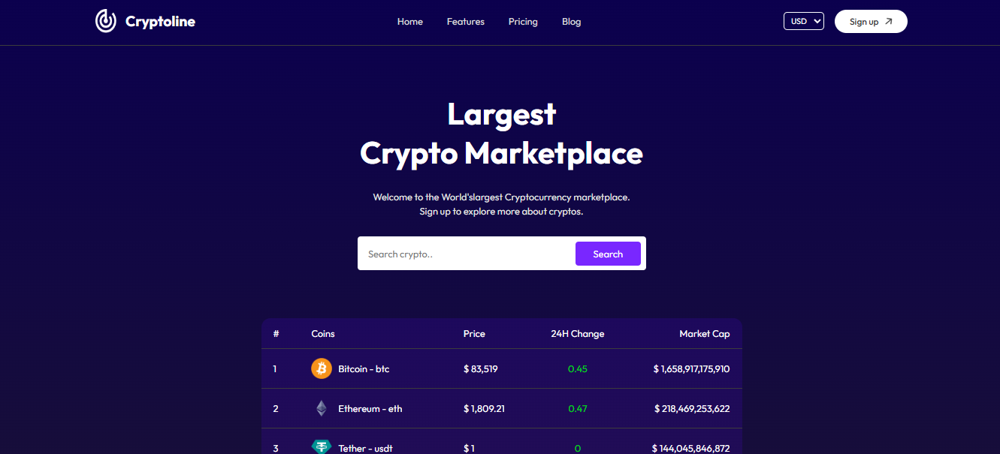
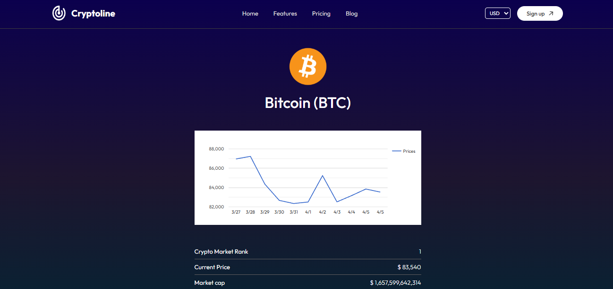

# CryptoLine


## <a name="introduction">💬 Introduction</a>

In the rapidly evolving world of digital finance, staying up-to-date with cryptocurrency prices is essential for investors, traders, and enthusiasts. This Cryptocurrency Real-Time Price Tracking Web App, built using React JS, provides users with live updates on the prices of various cryptocurrencies from around the globe.

The application leverages modern web development practices to deliver a fast, responsive, and intuitive user interface. By fetching real-time data from trusted crypto APIs, it ensures users have access to the most current market information. Whether you're monitoring Bitcoin, Ethereum, or a range of altcoins, this app makes it easy to track price fluctuations, view historical trends, and stay informed.

## <a name="preview">📸 Preview</a>
<p align="center">
  
<br>
  
  
<br>

</p>

## 🎯 Live Demo  
🔗 **[Check out the live demo here](https://crypto-line-jet.vercel.app/)**  

## <a name="tools">🛠️ Tools</a>

-   [React JS](https://react.dev)
-   [React Router Dom](https://reactrouter.com/)
-   [React-google-charts](https://www.npmjs.com/package/react-google-charts)
-   [CoinGecko API](https://www.coingecko.com/en/api)

## <a name="features">✨ Features</a>

- 🔄 Live Price Updates: Get real-time pricing data for popular cryptocurrencies using API integration.
- 📈 Interactive Charts: Visualize historical price trends with dynamic and responsive chart components.
- 🔍 Search & Filter: Easily find and track specific coins using a powerful search and filtering system.
- 🌐 Global Market Overview: View market cap, 24h volume, price changes, and rankings across multiple currencies.
- 📱  Responsive Design: Fully optimized for desktop and mobile devices.
- 🚀 Optimized Performance: Fast loading with efficient state management.


## <a name="getting-started">🚀 Getting Started</a>

To get started follow these steps:

#### Cloning the Repository

Using CLI

```bash
git clone https://github.com/smRid/Cryptoline.git
```

**\*\*_Ensure you have installed [Git](https://git-scm.com) on your machine._**

or using GitHub:

-   Go to the project [repository](https://github.com/smRid/Cryptoline.git) on my GitHub page
-   Click on the green button on the top 👆
-   Click Download ZIP

#### Installation

Install the project dependencies using npm:

```bash
npm install
```

**\*\*_Ensure you have installed [NodeJS](https://nodejs.org/en) on your machine._**

#### Running the Project

```bash
npm run dev
```

**\*\*_This project uses [Vite](https://vitejs.dev)._**
